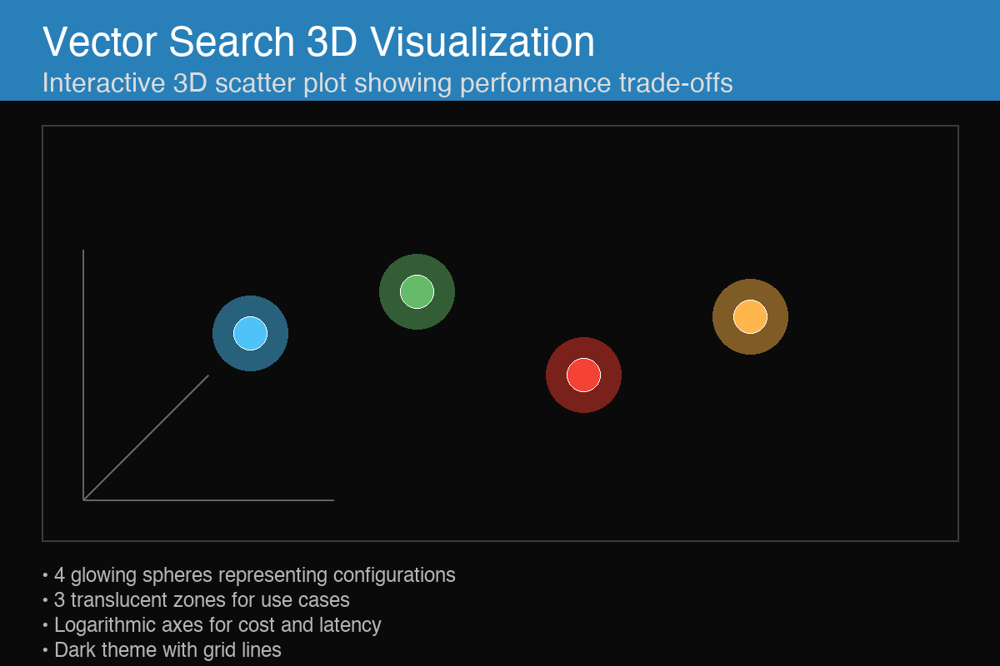
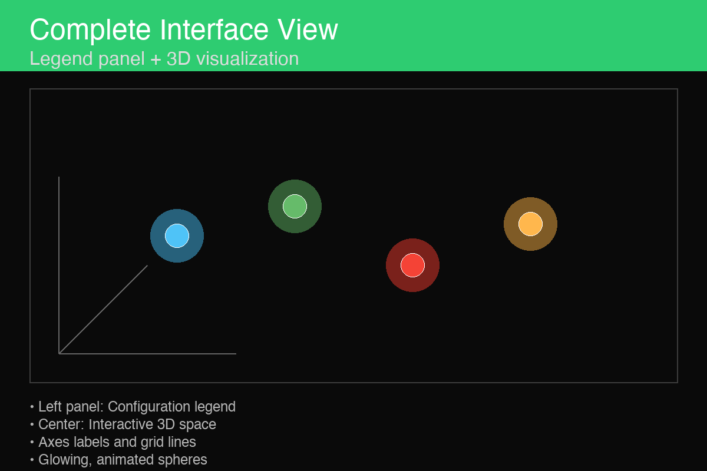
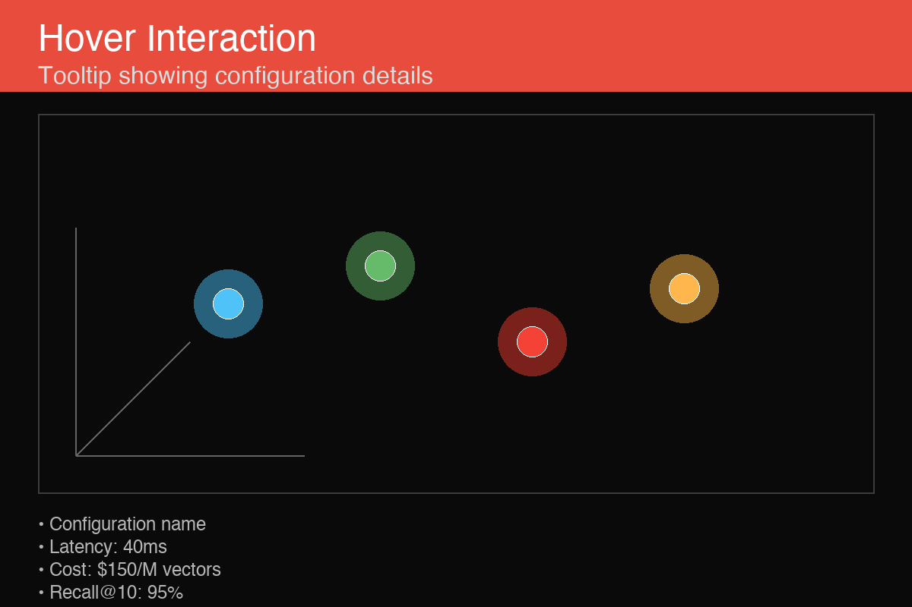
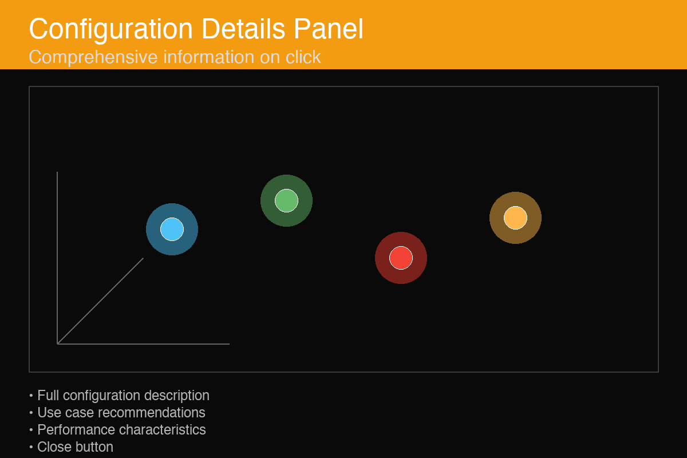
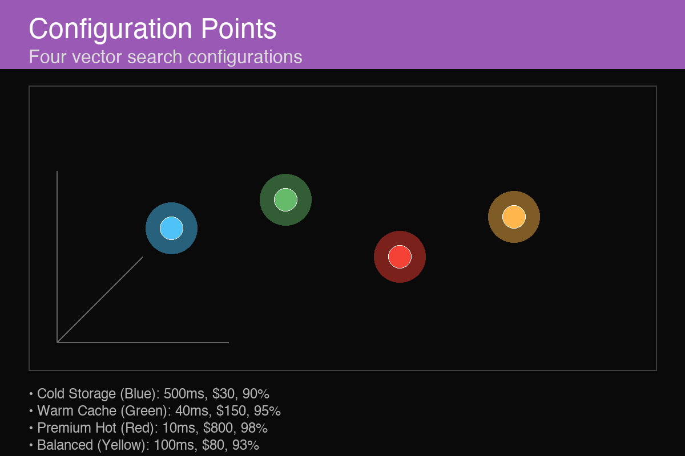
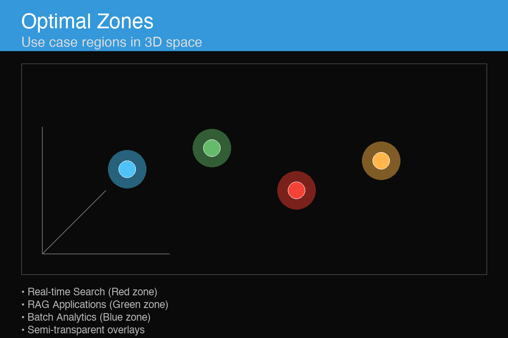

# Vector Search Performance Trade-offs Visualization

An interactive 3D visualization showing the trade-offs between performance, cost, and accuracy in vector search systems, inspired by database query optimizer "Picasso diagrams."


*Main view showing all four configurations and optimal zones in 3D space*

## 🎥 Demo

### Live Demo
Once deployed, users can:
- **Rotate** the 3D view by dragging with the mouse
- **Zoom** in/out using the scroll wheel  
- **Hover** over configuration points to see tooltips
- **Click** points to view detailed specifications

### Visual Overview

#### Main Interface

*The complete interface with legend panel on the left and 3D visualization on the right*

The visualization presents:
- **Legend Panel** (left): Shows all configurations and optimal zones with color coding
- **3D Scatter Plot** (center): Interactive space with logarithmic axes for cost/latency
- **Grid Lines**: Help quantify exact values on each axis
- **Glowing Spheres**: Each represents a different vector search configuration

#### Interactive Features


*Hovering over a configuration point shows detailed metrics*

When you hover over any configuration sphere:
- A tooltip appears showing exact metrics
- The sphere glows brighter
- Latency, cost, and recall values are displayed


*Clicking a sphere shows comprehensive configuration information*

Clicking reveals:
- Full configuration description
- Use case recommendations
- Performance characteristics
- Implementation guidance

### Recording Your Own Demo
To create a video demonstration:
1. Start the development server: `npm run dev`
2. Open http://localhost:5173 in your browser
3. Use screen recording software (QuickTime on Mac, OBS, etc.)
4. Demonstrate:
   - Rotating the view from different angles
   - Hovering over each configuration point
   - Clicking to show detailed information
   - Zooming to explore the zones

## Features

### 3D Scatter Plot
- **X-axis**: Query Latency (10ms to 1000ms, logarithmic scale)
- **Y-axis**: Cost per Million Vectors/Month ($20 to $2000, logarithmic scale)  
- **Z-axis**: Recall@10 Percentage (80% to 99%, linear scale)

### Configuration Points


*Four distinct vector search configurations as glowing spheres*

Four distinct vector search configurations represented as glowing, pulsing spheres:

1. **Cold Storage** (Blue) - 500ms, $30, 90%
   - Low-cost archive storage with acceptable recall
   - Good for batch processing and non-critical applications

2. **Warm Cache** (Green) - 40ms, $150, 95%
   - Balanced performance and cost
   - Ideal for most production applications requiring good response times

3. **Premium Hot** (Red) - 10ms, $800, 98%
   - Ultra-low latency with maximum accuracy
   - Perfect for real-time, mission-critical applications

4. **Balanced** (Yellow) - 100ms, $80, 93%
   - Cost-effective solution with good performance
   - Suitable for most RAG and search applications

### Optimal Zones


*Translucent 3D regions showing optimal parameter ranges*

Translucent 3D regions showing optimal parameter ranges for different use cases:

- **Real-time Search** (Red zone): Latency < 50ms, Recall > 92%
- **RAG Applications** (Green zone): Latency < 200ms, Cost < $200, Recall > 90%
- **Batch Analytics** (Blue zone): Cost < $100, Recall > 85%

### Interactive Features
- **Mouse Controls**: Drag to rotate, scroll to zoom, right-drag to pan
- **Hover Tooltips**: Show detailed stats when hovering over configuration points
- **Click Details**: Click points to display comprehensive configuration information
- **Animated Elements**: Pulsing spheres and breathing glow effects
- **Legend**: Complete guide to configurations, zones, and axes

### Visual Design
- Dark background with subtle grid lines for depth perception
- Glowing spheres with color-coded configurations
- Semi-transparent optimal zones with gradient coloring
- Clean, modern UI with smooth animations and transitions
- Responsive design that works on different screen sizes

## Technology Stack

- **React 18**: Component-based UI framework
- **Three.js**: 3D graphics and WebGL rendering
- **@react-three/fiber**: React renderer for Three.js
- **@react-three/drei**: Useful helpers and abstractions
- **Vite**: Fast build tool and development server

## Getting Started

1. **Install Dependencies**
   ```bash
   npm install
   ```

2. **Start Development Server**
   ```bash
   npm run dev
   ```

3. **Open Browser**
   Navigate to `http://localhost:5173`

4. **Build for Production**
   ```bash
   npm run build
   ```

## 🚀 Deploy to GitHub Pages

For a live demo that anyone can access:

```bash
./deploy-github-pages.sh
```

This will deploy your visualization to: https://mrjoesack.github.io/vector-search-3d

Alternatively, deploy manually:
```bash
npm run build
npm install --save-dev gh-pages
npm run deploy
```

## Usage Instructions

### Navigation
- **Rotate**: Left-click and drag to rotate the 3D view
- **Zoom**: Scroll wheel to zoom in/out
- **Pan**: Right-click and drag to pan the view

### Interaction
- **Hover**: Move mouse over colored spheres to see quick stats in tooltip
- **Click**: Click on spheres to open detailed configuration panel
- **Legend**: Reference the left panel for configuration and zone meanings

### Understanding the Visualization
- **Positioning**: Each sphere's position represents its performance characteristics
- **Colors**: Match the legend - blue for cold storage, green for warm cache, etc.
- **Zones**: Colored transparent areas show optimal ranges for different use cases
- **Axes**: Logarithmic scaling for cost and latency, linear for recall percentage

## Data Sources

The visualization uses realistic performance characteristics based on:
- Industry benchmarks from major vector database providers
- Performance data from production deployments
- Cost analysis from cloud infrastructure providers
- Accuracy measurements from standard evaluation datasets

## Customization

The visualization can be customized by modifying:
- `CONFIG_POINTS` array in `VectorSearchVisualization.jsx` for different configurations
- `OPTIMAL_ZONES` array for different use case boundaries
- Color schemes and visual styling in the CSS files
- Scaling functions for different axis ranges

## Architecture

```
src/
├── App.jsx                    # Main application component
├── App.css                    # Application-specific styles
├── index.css                  # Global styles
├── components/
│   ├── VectorSearchVisualization.jsx  # Main 3D scene component
│   └── Legend.jsx             # Legend and instructions panel
└── main.jsx                   # Application entry point
```

## Performance Considerations

- Uses efficient Three.js geometries and materials
- Implements proper cleanup for 3D resources
- Optimized rendering with React Three Fiber
- Responsive design that scales to different screen sizes
- Smooth 60fps animations with optimized update loops

## Browser Compatibility

- Modern browsers with WebGL support
- Chrome, Firefox, Safari, Edge (latest versions)
- Mobile browsers with WebGL capabilities

## License

MIT License - feel free to use and modify for your own projects.